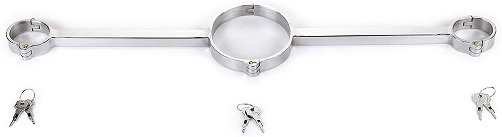

# Rigidbind

Open source modular connection specification for metal components. Especially kinky ones.

## What is Rigidbind?

It's a post-and-link standard for allowing metal items to be quickly joined together in a variety
of ways.

It is:

- Simple: the basic designs can be executed with ordinary metal shop tooling, no CNC needed.
- Standard: there are a few key design elements and measurements that apply to every rigidbind item.
- Shared: these elements and measurements are freely available to the community, and may not be
  copyrighted. Publishing these openly here is intended to show prior art, preventing patenting.
- Open Source: these design elements and measurements are documented here under a Creative
  Commons license. 

## Why Rigidbind?

Rigidbind was inspired by frustration with the state of metal bondage equipment in the world.

Metal bondage equipment as generally available now (early 2022) is generally constructed as
monolithic pieces, that can't be converted to other uses, and that won't generally fit a range
of people very well. For example, this yoke:

This is a lovely item. But it will only fit someone who has _both_ a neck _and_ wrists that are
almost exactly the size of this piece. There is no adjustability.

As another example, these cuffs:

These can only be chained together with loose chain, never rigidly. If you had a set of these
that fit you perfectly, you wouldn't be able to use them as a rigid yoke like the one above.

The core idea of rigidbind is _separate modular pieces that lock together quickly, rigidly,
and interchangeably._ So you can get one set of personal items (cuffs, collar, etc.) that
actually fit you beautifully, and then plug and lock them into all kinds of other gear. Think
of it as a "metal bondage kit" and you're on to something.

## How does Rigidbind work?

Rigidbind boils down to two basic concepts: posts and links.

### The rigidbind post

The core design element of rigidbind is the rigidbind _post_. In the non-metric rigidbind specification,
it is simply:

- A one inch long section of 3/4 inch diameter solid metal rod, with 17/64 inch holes drilled
  perpendicularly through the center.
  
A schematic drawing:

Some prototype standalone posts:

A collar with a post welded on:

Some wrist cuffs with posts welded on:

The reason the holes are 1/4 inch wide is to allow padlocks with 1/4 inch hasps to fit through.
For example:

### The Rigidbind link

The basic pattern for rigidbind sockets (in the US/UK specification) is: any metal item with a
49/64-inch hole (e.g. 1/64 inch more than the 3/4 inch diameter of the post), and a separate
and perpendicular 17/64-inch pair of holes (e.g. the same width as the holes in the post).

Here is a sketch of one such link:

Simply put: you put the post in the link, then put a pin or a padlock through the post and
link together. Now you have an instant rigid connection that will not rotate or slide in any
direction.

Some prototype links:

A cuff locked to a link:

This connection is rigid and won't rotate or slide in any direction:

Use a short link to join two cuffs, and you have a rigid pair of handcuffs:

Use a link with three larger holes, and you can add a collar:

But since few bottoms are flexible enough to actually fit something that snug, you can join multiple links and connecting rods together:

And so on. There are many, many more possibilities.

### Rigidbind gear: anyone can play

I am putting this design concept openly on the internet under a Creative Commons license,
in order to allow anyone interested in making this kind of gear to be able to do so.
It is deliberately simple enough that anyone with a basic metal shop can try out making
gear according to this pattern.

I do plan to trademark the term Rigidbind, so that people who want to use the Rigidbind brand
can have a single point of contact, and so that we can test Rigidbind-branded gear to make sure
it is sized properly and is compatible with other Rigidbind gear. The trademark terms will be
very inexpensive; the goal is to help all Rigidbind gear-makers be aware of each other and to
help the Rigidbind gear community grow more quickly.

### Interested? Contact me

If you are thinking of trying out making Rigidbind gear, please contact me at [roderickgrey@protonmail.com](mailto:roderickgrey@protonmail.com)
as I would love to know what you are up to!

### Credits

Thanks very much to [Jessie Sparkles](https://twitter.com/Jessiesparklesx) and [Alan Tchochiev](https://twitter.com/alantchochiev)
for their help with the metal fabrication and prototyping for this project.